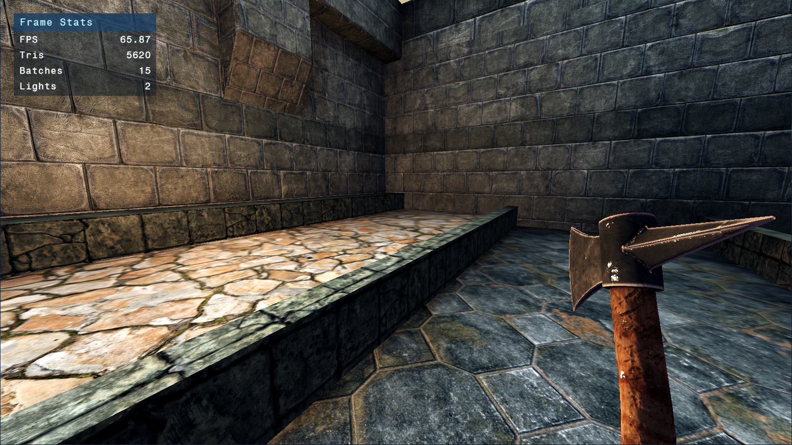
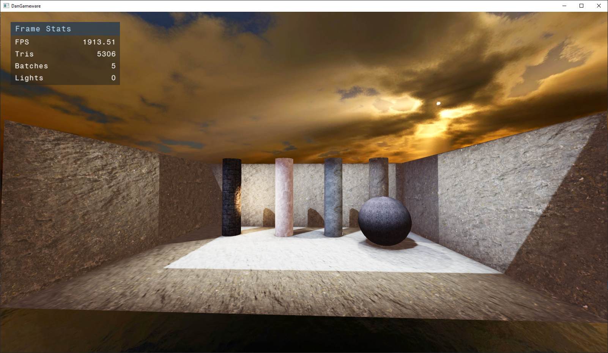
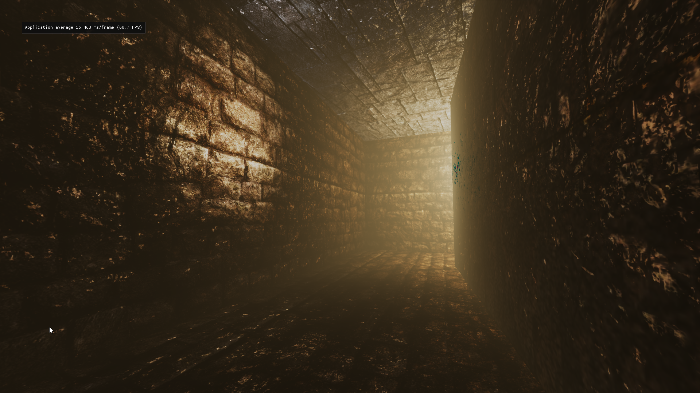
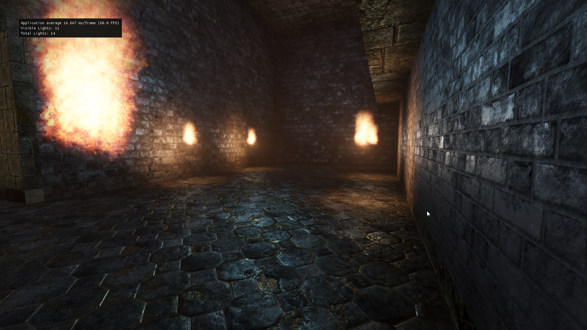
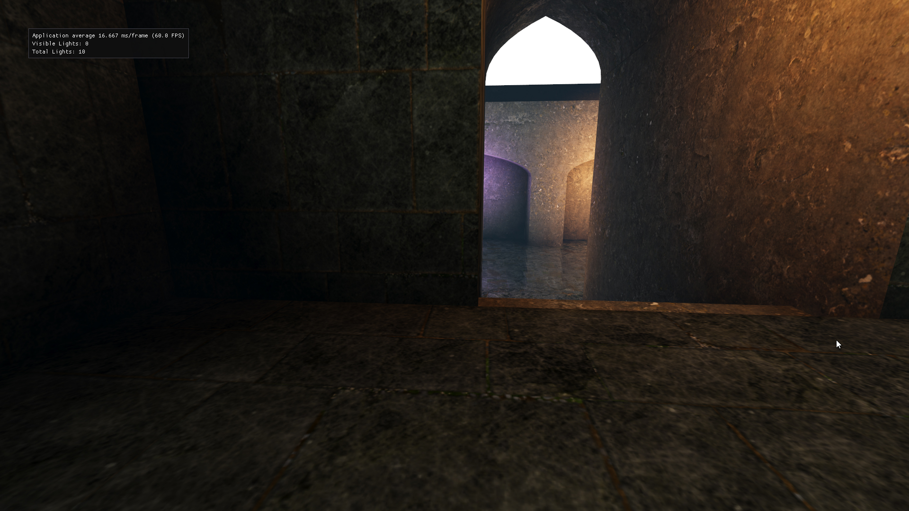
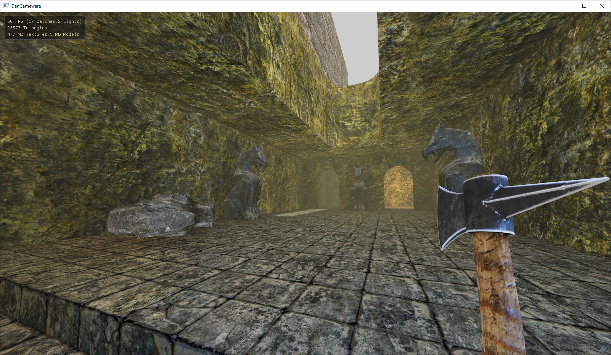
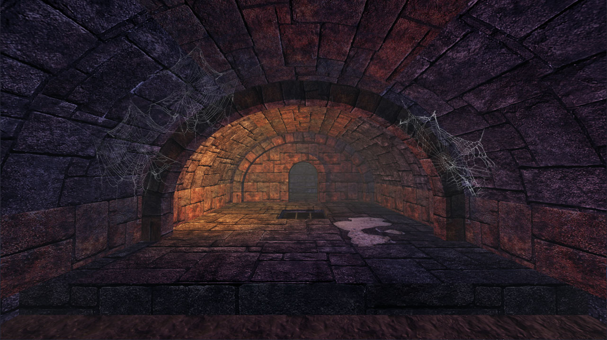
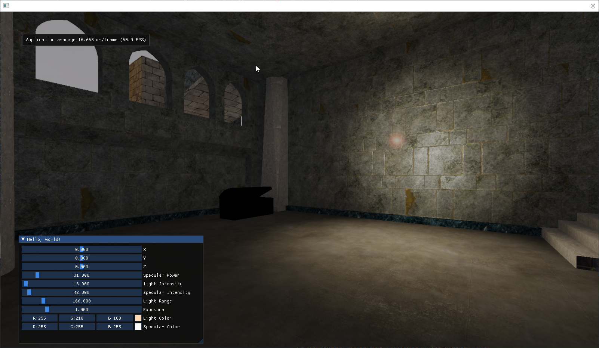
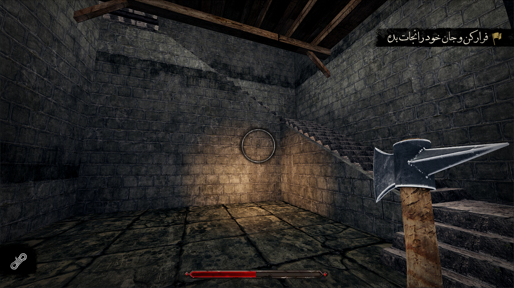
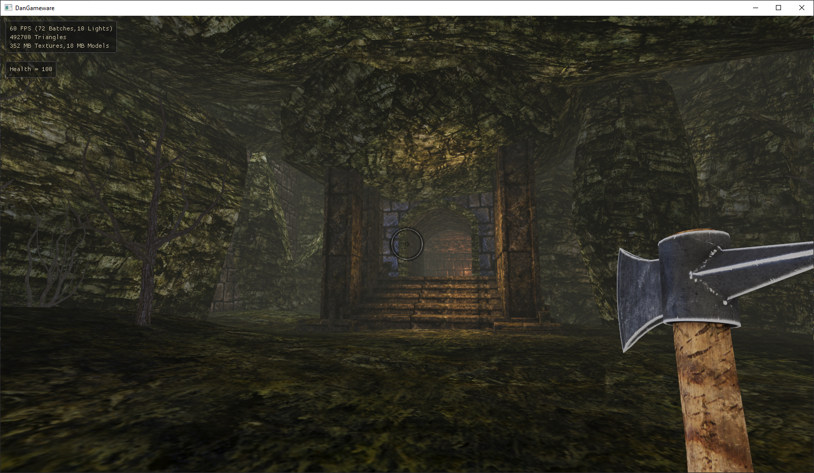

# DanGameware Engine

A custom game engine targeting low-end PCs with a modern take on pre-2007 era game development. Built for creating a medieval Persian-themed action game.



## Overview

DanGameware is a lightweight game engine designed to deliver modern visual quality on older hardware. The engine features a heavily modified fork of Horde3D as its graphics foundation, complemented by custom-built subsystems for physics, AI, animation, and more.

### Design Philosophy

- **Performance First**: Optimized for low-end PCs and integrated graphics
- **Retro-Modern Aesthetic**: Pre-2007 game design sensibilities with contemporary rendering techniques
- **Production Ready**: Built alongside a real game, not as a tech demo

## Features

### Graphics Engine (Modified Horde3D)

The graphics subsystem is based on a heavily customized Horde3D fork, implementing:

- **HDR Rendering Pipeline** with tone mapping
- **Baked Lightmaps** for static lighting with minimal runtime cost
- **Volumetric Lighting** effects
- **Particle Systems** with compute shader support
- **Deferred and Forward Rendering** pipelines
- **Decal System** for environmental detail
- **Reflective Surfaces** and dynamic fog


*Baked lightmap system for efficient static lighting*


*Volumetric light shafts*


*Real-time particle effects*


*Dynamic reflections*


*Atmospheric fog rendering*


*Dynamic decal system*

### Asset Pipeline

Custom content pipeline built around classic modding tools:

- **BSP Importer**: Direct import of Quake 3 maps created in GTKRadiant
- **Collada Converter**: Custom 3D animation format with Collada importers
- **Material System**: XML-based material definitions
- **Texture Processing**: Automated DDS conversion pipeline

### Physics Engine

Lightweight, purpose-built physics system featuring:

- Custom collision detection and resolution
- **Sliding Sphere Character Controller** for smooth character movement
- Optimized for gameplay feel over simulation accuracy

### AI System

Complete AI framework including:

- **Finite State Machines** for enemy behavior
- **Pathfinding** algorithms for navigation
- **Steering Behaviors** for movement and flocking
- Modular design for different enemy types

### Animation System

Custom animation pipeline:

- Proprietary 3D animation format optimized for performance
- Collada (.dae) import support via custom converter
- Skeletal animation with efficient bone hierarchy

### Sound Engine

Audio implementation using **SoLoud**:

- 3D positional audio
- Multiple audio streams
- Low-latency playback

### Development Tools


*In-game editor and debugging tools*

- **In-Game Editor** powered by Dear ImGui
- Real-time debugging visualization
- Performance profiling
- Entity inspection and manipulation


*In-game HUD demonstration*


*Visual development and shader testing*

## Project Structure

```
DanGameware/
├── DanGameware/          # Main engine source code
│   ├── ai.cpp/h          # AI systems and behaviors
│   ├── PhysicsEngine.*   # Physics and collision
│   ├── MapManager.*      # Level management
│   ├── SoundEngine.*     # Audio wrapper
│   ├── Enemy.*           # Enemy AI implementation
│   ├── FPSCharacter.cpp  # Player controller
│   └── content/          # Game assets
├── KhHorde3D/            # Modified Horde3D graphics engine
├── tools/                # Asset conversion tools
│   ├── KhBspConv/        # Quake 3 BSP converter
│   ├── ColladaConverter/ # Animation importer
│   ├── blendexport/      # Blender export scripts
│   └── matsync/          # Material synchronization
└── docs/                 # Documentation and screenshots
```

## Technical Stack

- **Language**: C++
- **Graphics API**: OpenGL (via Horde3D)
- **Window/Input**: GLFW
- **UI**: Dear ImGui
- **Audio**: SoLoud
- **Scripting**: Lua
- **Build System**: Visual Studio 2019+

## Building

### Prerequisites

- Visual Studio 2019 or newer
- Windows 10+
- OpenGL 3.3+ capable graphics card

### Build Steps

1. Clone the repository
2. Open `DanGameware/DanGameware.sln` in Visual Studio
3. Build the solution (F7)
4. Run `build.bat` to compile the engine and tools

## Tools & Workflow

### Map Creation
1. Design levels in **GTKRadiant** using Quake 3 format
2. Convert BSP files using `KhBspConv` tool
3. Import into engine with automatic lightmap baking

### 3D Assets
1. Model and animate in Blender or other DCC tools
2. Export to Collada format
3. Convert using `ColladaConverter` to engine format
4. Material assignment via XML descriptors

## Development Status

🚧 **Work in Progress** - This engine is actively being used to develop a medieval Persian-themed action game.

### Current Focus
- Game mechanics implementation
- Enemy AI refinement
- Level design and art integration
- Performance optimization for integrated GPUs

## Philosophy & Goals

This engine deliberately avoids cutting-edge graphics techniques in favor of:
- **Consistent Performance**: 60 FPS on integrated graphics
- **Artistic Direction**: Style over technical complexity
- **Accessibility**: Playable on older hardware
- **Rapid Iteration**: Fast build times and quick asset pipeline

The goal is to prove that compelling games can be built without requiring high-end hardware, while still delivering a visually appealing experience through smart use of baked lighting, careful optimization, and strong art direction.

## License

[Add your license information here]

## Acknowledgments

- **Horde3D**: Base graphics engine (heavily modified)
- **SoLoud**: Audio engine
- **Dear ImGui**: Debug UI and editor
- **GTKRadiant**: Level design tool
- **Irrlicht**: BSP loading reference

---

*Built with passion for games that run everywhere.*

